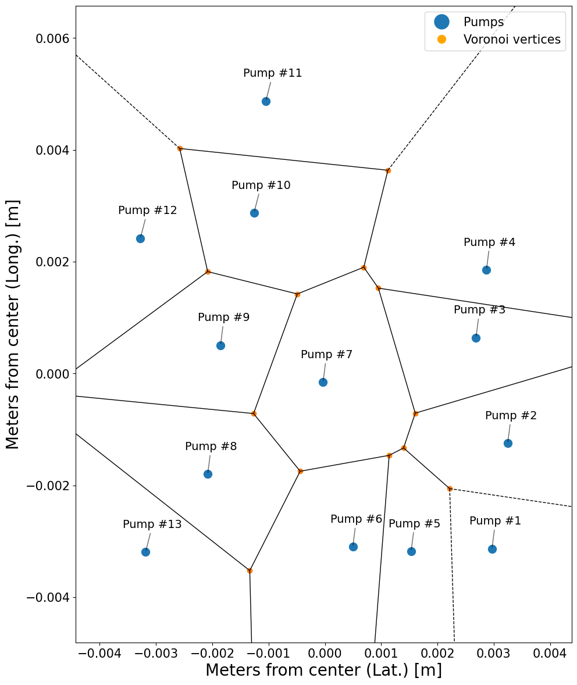
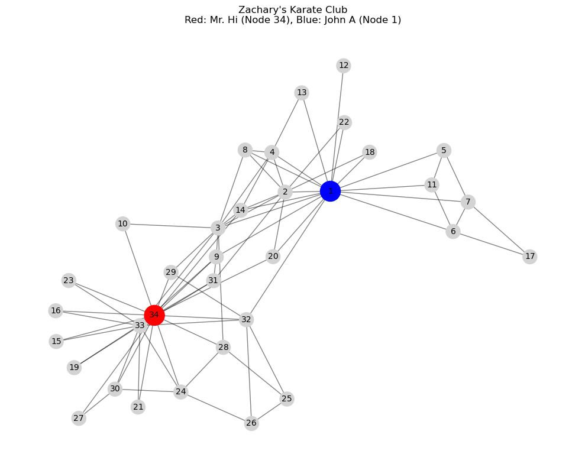
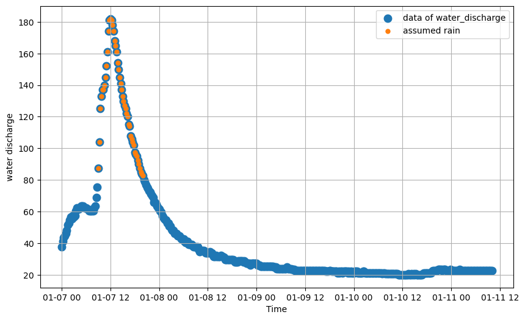

Here are the projects we had during the course.

In each folder there is the notebook and a final run in html of the titular topic.

## Image exploration
IMage exploration has 2, one is about finding edges, corners, and recreating the image from grey scale , while the other notebook is about image segmentation, in the example I had to count colored candies.

## Map
Map contains a project about John Snow, who was an English physician, who was first to trace the source of a cholera outbreak in London's Soho district in 1854 using data visualization. I had to recreate his work using python.

  

## networks
Using Python and NetworkX, I explored fundamental graph concepts, analyzed real and synthetic networks, and compared different random graph models such as Erdős–Rényi and Barabási–Albert.

  

## NLP
NLP contains the project where I needed to work with real-world text data to perform preprocessing, tokenization, frequency analysis, sentiment analysis, topic modeling, and text classification.
## Waterlevel_statistics
In this project I had to find a dataset about a river's water level, and decide when did it rain from the waterlevel, whether there was an anomaly, dry season and more.

  

